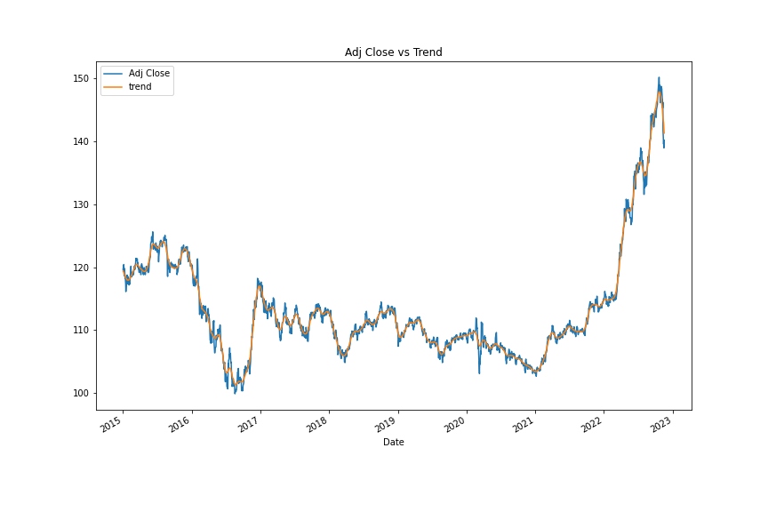

# A Yen For The Future

## Background

The financial departments of large companies often deal with foreign currency transactions while doing international business. As a result, they are always looking for anything that can help them better understand the future direction and risk of various currencies. Hedge funds, too, are keenly interested in anything that will give them a consistent edge in predicting currency movements. In this Analysis, I will test my data using the ARMA, 
ARIMA, and GARCH models in order to predict future movements in the value of the Japanese yen versus the U.S. dollar.

---

## Files

Use the following:

[Time-Series Starter Notebook](./TimeSeriesAnalysis.ipynb)

[Linear Regression Starter Notebook](./RegressionAnalysis.ipynb)

### If you are interested in seeing how this project works with other Foreign Exchange pairs, check out the folder called Universal. The same studies are in there except the user can interact with the API and decide which Forex pair they would like to study.

[Universal-Time-Series Starter Notebook](./Universal/TimeSeriesAnalysis.ipynb)

[Universal-Linear Regression Starter Notebook](./Universal/RegressionAnalysis.ipynb)

---

## Time-Series Forecasting

Apply time series analysis and modeling to determine whether there is any predictable behavior from historical Dollar-Yen exchange rate futures data.

The Following has been utilized in analysing historical data for the Yen:

Time Series Forecasting Linear Regression Modeling

---

## Questions to be answered

    Based on your time series analysis, would you buy the yen now?
    
    Is the risk of the yen expected to increase or decrease?
    
    Based on the model evaluation, would you feel confident in using these models for trading?

---

## Steps Taken:

    Decomposition using a Hodrick-Prescott Filter (Decompose the Settle price into trend and noise).
    
    Forecasting Returns using an ARMA Model.
    
    Forecasting the Settle Price using an ARIMA Model.
    
    Forecasting Volatility with GARCH.
    
    
    
Based on the time series analysis, I would not feel confident buying Yen because both the ARIMA model and the ARMA model have a P > 0.05. Therefore they are not significant. However, the GARCH model is significant predicting volatility. This is important when trading derivitives because as per this model it states the volatility will keep decreasing in the next 5 days, therefore trading derivitives would be your best option. The GARCH model is also useful to quantify you're maximum loss as you can calculate what you're risk is in purchasing Yen.

I would not feel comfortable using these models to trade. ARMA and ARIMA are not accurate and GARCH is only slightly useful in a specific kind of investing.

---

## Linear Regression Forecasting

Does this model perform better or worse on out-of-sample data compared to in-sample data?
Steps taken:

    Data Preparation (Creating Returns and Lagged Returns and splitting the data into training and testing data)
    Fitting a Linear Regression Model.
    Making predictions using the testing data.
    Out-of-sample performance.
    In-sample performance.

---

## Conclusion

The model has a root mean square error of 0.484% on out-of-sample data and 0.7535% on in-sample data. Hence, the model performs better with data that it has not worked with before.

In this particular model, The out of sample performed slightly worse than the In-sample data. The Out-of-sample had a root mean squared error of 0.484, while the in-sample data has an RMSE of .7535. From this data I would say the model has a "good" fit eventhough the In-Sample data and the Out of Sample results is highly deviant from each other.

---

## Images

